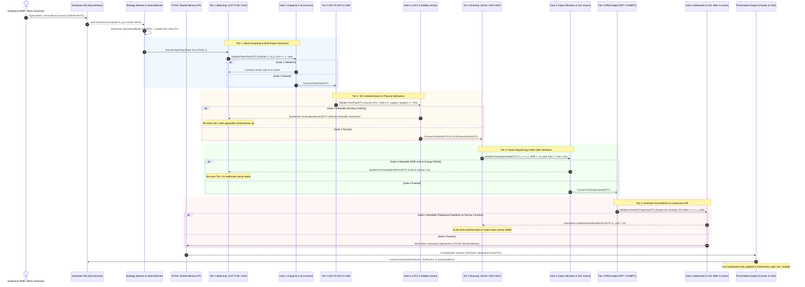
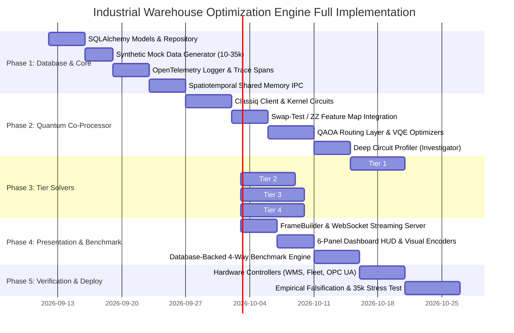

# PRODUCTION IMPLEMENTATION PLAN & ARCHITECTURAL BLUEPRINT
## Extended Rich Multi-Depot, Multi-Trip, Multi-Commodity Pickup-and-Delivery Problem with Open Time Windows, 3D Containerization, Human-Robot Shared Spaces, Stochastic Disruption Recourse, Classiq Quantum Co-Processor Acceleration, Database Layer, and Advanced Telemetry Presentation ($\mathcal{P}_{\text{ER-MD-VRPTW-3D-HRI-Q}}$)

---

### Document Metadata
- **Classification:** Enterprise Core Engine Specification, Quantum-Classical Hybrid Blueprint, Database Architecture & Telemetry Pipeline
- **Language / Runtime:** Python 3.11+ / C++20 / Classiq SDK (Qmod Synthesis & Execution) / SQLAlchemy 2.0 (SQLite / PostgreSQL)
- **Target Scale:** 35,000+ Customer Lines, 150+ AMRs, 2–8 Regional Depots, 10–50 AS/RS Spurs
- **Persistence & Storage:** Relational / Timeseries Database Layer (Scenario Versioning, Input Mock Data, Execution Snapshots, Benchmarks)
- **Quantum Integration:** Classiq Quantum Synthesis Engine (QAOA, Swap-Test Kernels, ZZ Feature Maps, QUBO Solvers)
- **Verification Protocol:** Empirical Falsification Directive (Verification Code: `lmn`) & Quantum Advantage Audit
- **Presentation & Observability:** OpenTelemetry JSON Structured Tracing, 50Hz/10Hz Double-Buffered Simulation Frames, Real-Time Executive HUD, Deep Classiq Circuit Profiler

---

## 1. Executive Mission & System Architecture

### 1.1 Problem Statement and Industrial Context
The optimization engine solves the comprehensive multi-tier intra-facility logistics problem ($\mathcal{P}_{\text{ER-MD-VRPTW-3D-HRI-Q}}$). In mega-scale fulfilment centers, traditional classical monolithic solvers fail due to exponential state explosion and rigid coupling between 3D physical constraints, spatiotemporal route sequencing, and sub-second kinematic trajectory deconfliction.

This architecture decouples the combinatorial problem across **four distinct hierarchical tiers** governed by mathematical Benders decomposition, supercharged by a **Classiq Quantum Co-Processor Layer**, backed by an **Enterprise Persistence & Database Layer**, and observed via a **High-Fidelity Structured Telemetry and Presentation Pipeline**:
1. **Enterprise Database & Mock Storage Layer:** Formally archives warehouse topologies, synthetic mock scenario seeds (10 to 35,000 orders), execution run snapshots, tier-by-tier calculation artifacts, and historical benchmark comparisons.
2. **Tier 1 (Master Batching & Allocation):** Solves high-level wave clustering, multi-depot catchment balancing, and stochastic SLA fulfillment under inventory discrepancies. Accelerated by **Quantum-Enhanced Spatio-Temporal Fuzzy C-Means (Q-ST-FCM)** using Classiq Swap-Test quantum kernels and QAOA-based multi-depot balanced graph partitioning.
3. **Tier 2 (3D Containerization & Mechanics):** Packs non-uniform rectangular cuboids into robot bays, enforcing static equilibrium, dynamic center of mass (CoM) stability, and acyclic LIFO door extraction.
4. **Tier 3 (Route Sequencing Under Open Windows):** Sequences pickups and chute drops under asymmetric open time windows, shift boundaries, and battery State-of-Charge (SoC) profiles. Accelerated by **Classiq QAOA Parameterized VRP Circuits** for critical combinatorial subtour optimization.
5. **Tier 4 (Kinematic Deconfliction & Continuous HRI):** Generates 50Hz continuous parametric splines over continuous swept volumes, resolving narrow-aisle head-on blockages and enforcing ISO 3691-4 safety deceleration around human workers.
6. **Observability & Presentation Engine:** Ingests calculation telemetry across all algorithms and tiers, compiling frame-by-frame structured state for 2D/3D interactive visual simulators, the 6-Panel Executive Dashboard, and deep Classiq quantum circuit diagnostics.

### 1.2 Global Package & File Hierarchy

```
applications/logistics/vehicle_routing_problem/
├── engine/
│   ├── __init__.py
│   ├── config.py                          # Global hyperparameters, latency budgets, quantum preferences
│   ├── types.py                           # Primitive types, physical units, matrix aliases
│   │
│   ├── storage/                           # Enterprise Database & Mock Data Persistence Layer
│   │   ├── __init__.py
│   │   ├── database.py                    # Connection pooling, session factories (SQLite / PostgreSQL)
│   │   ├── models.py                      # SQLAlchemy 2.0 declarative ORM models (Scenarios, Runs, Tiers, Quantum)
│   │   ├── repository.py                  # CRUD repository for scenarios, wave executions, and metrics
│   │   ├── mock_generator.py              # Deterministic synthetic warehouse scenario generator (10 to 35k orders)
│   │   ├── migration.py                   # Schema initialization and versioning
│   │   └── comparison_service.py          # Database-backed cross-run historical comparator & regression detector
│   │
│   ├── telemetry/                         # Advanced Structured Logging & OpenTelemetry Instrumentation
│   │   ├── __init__.py
│   │   ├── logger.py                      # OpenTelemetry structured JSON/ECS event logger
│   │   ├── tracer.py                      # Distributed trace spans for waves, tiers, and subproblems
│   │   ├── metrics_registry.py            # Prometheus/OpenTelemetry real-time counters & histograms
│   │   └── audit_trail.py                 # Falsification code `lmn` immutable audit recorder
│   │
│   ├── contracts/                         # Immutable Pydantic v2 Data Transfer Objects (DTOs)
│   │   ├── __init__.py
│   │   ├── base.py                        # StrictImmutableDTO base with slot optimization
│   │   ├── storage_dto.py                 # ScenarioMetaDTO, RunSnapshotDTO, MockConfigDTO
│   │   ├── tier1_dto.py                   # OrderPoolDTO, BatchPlanDTO, SLAProofDTO, ChuteInflowDTO
│   │   ├── tier2_dto.py                   # ItemManifestDTO, PackPlanDTO, LIFOExtractionDAGDTO
│   │   ├── tier3_dto.py                   # RoutingScheduleDTO, ArrivalTimestampsDTO, SoCProfileDTO
│   │   ├── tier4_dto.py                   # KinematicTrajectoryDTO, SweptReservationsDTO, PriorityDAGDTO
│   │   ├── quantum_dto.py                 # QuantumCircuitSpecDTO, QAOAResultsDTO, QuantumKernelMatrixDTO, ClassiqTelemetryDTO
│   │   ├── benders_dto.py                 # PackingBendersCutDTO, RoutingBendersCutDTO, SpatiotemporalDeadlockCutDTO
│   │   ├── presentation_dto.py            # SimulationFrameDTO, DashboardHUDDTO, AlgorithmBenchmarkComparisonDTO
│   │   └── telemetry_dto.py               # FleetTelemetryUpdate, ZoneOccupancyEvent, ASRSHoistRegistryDTO
│   │
│   ├── presentation/                      # Simulator Presentation & Dashboard Structured Data Engine
│   │   ├── __init__.py
│   │   ├── frame_builder.py               # Interpolates 50Hz splines into 10Hz/20Hz simulation frames
│   │   ├── visual_state_encoder.py        # Encodes 3D bounding boxes, heatmaps, and swept tubes for GUI
│   │   ├── dashboard_aggregator.py        # Compiles 6-Panel Executive presentation telemetry
│   │   ├── streaming_server.py            # WebSocket/SSE streaming server for Web SPA & Desktop GUI
│   │   └── comparison_exporter.py         # Multi-algorithm benchmark visualization generator
│   │
│   ├── state/                             # High-Performance Spatiotemporal Shared Memory
│   │   ├── __init__.py
│   │   ├── world_state.py                 # Double-buffered SpatiotemporalWorldState
│   │   ├── shared_memory_ipc.py           # POSIX SharedMemory / Apache Arrow 50Hz streaming
│   │   ├── reservation_table.py           # Thread-safe R-Tree continuous-time interval reservation
│   │   ├── ring_buffer.py                 # Lock-free 6-DoF pose telemetry ring buffer
│   │   └── invalidation.py                # Dirty-bit corridor invalidator (drift > 0.3m, skew > 2.0s)
│   │
│   ├── gates/                             # Invariant Validation Gates & Infeasible Subsystem Analyzers
│   │   ├── __init__.py
│   │   ├── base_gate.py                   # BaseValidationGate abstract class
│   │   ├── gate1_batch.py                 # Gate 1: Payload capacity & SLA chance-constraint reliability
│   │   ├── gate2_packing.py               # Gate 2: LIFO DAG acyclicity, CoM stability margin, 75% support
│   │   ├── gate3_routing.py               # Gate 3: Open time windows, shift limits, SoC bounds
│   │   └── gate4_kinematics.py            # Gate 4: Minkowski envelope clearance, ISO 3691-4 throttling
│   │
│   ├── strategy/                          # Context-Aware Strategy Selector & Fallback State Machine
│   │   ├── __init__.py
│   │   ├── context_engine.py              # Telemetry & scale evaluator (S_sys context vector)
│   │   ├── state_machine.py               # OperationalMode state machine (NORMAL, AGILITY, DEGRADED, QUANTUM)
│   │   └── fallback_router.py             # Automatic rank step-down and quantum-to-classical router
│   │
│   ├── tiers/                             # Four-Tier Optimization Hierarchy
│   │   ├── __init__.py
│   │   ├── base.py                        # BaseTierSolver abstract base class
│   │   │
│   │   ├── tier1_batching/                # Tier 1: Master Batching & Allocation (R8, R9, R13, R15)
│   │   │   ├── rank1q_quantum_fcm.py      # Rank 1Q: Quantum-Enhanced FCM (Classiq Swap-Test / ZZ Kernels)
│   │   │   ├── rank1_fcm_dr_saa.py        # Rank 1: Classical Spatio-Temporal FCM + Wasserstein DR-SAA
│   │   │   ├── rank2_nsga3.py             # Rank 2: NSGA-III Reference-Point MOEA
│   │   │   ├── rank3_kmeans_pp.py         # Rank 3: Constrained Spatio-Temporal K-Means++
│   │   │   └── subproblem_lp.py           # SAA LP Dual Reformulation Solver
│   │   │
│   │   ├── tier2_containerization/        # Tier 2: 3D Packing & Mechanics (R4, R10)
│   │   │   ├── rank1_cpsat_misocp.py      # Rank 1: CP-SAT (diffn) + MISOCP CoM Verification
│   │   │   ├── rank2_dual_ga.py           # Rank 2: Dual-Chromosome GA (Seq + Rot) + Extreme Points
│   │   │   ├── rank3_action_drl.py        # Rank 3: Action-Masked 3D-Pointer Net (ONNX inference)
│   │   │   ├── extreme_points.py          # 3D Extreme Points placement generator with door-ray test
│   │   │   └── mechanics.py               # CoM, support polygon, friction cone, tipping moment analysis
│   │   │
│   │   ├── tier3_routing/                 # Tier 3: Route Sequencing Under Open Windows (R1, R2, R3, R6, R7)
│   │   │   ├── rank1q_qaoa_routing.py     # Rank 1Q: Classiq QAOA Open-Window VRP Synthesizer
│   │   │   ├── rank1_hgs_adc.py           # Rank 1: Classical HGS-ADC with Asymmetric Open Split
│   │   │   ├── rank2_asym_alns.py         # Rank 2: Asymmetric ALNS with DQN Operator Selection
│   │   │   ├── rank3_bpc_pulse.py         # Rank 3: Branch-Price-and-Cut with Pulse Pricing
│   │   │   ├── split_algorithm.py         # Asymmetric Bellman-Ford Split with soft lateness subgradients
│   │   │   └── operators_alns.py          # Shaw removal, regret-k reinsertion, ruin-and-recreate
│   │   │
│   │   └── tier4_kinematics/              # Tier 4: Kinematic Deconfliction & Continuous HRI (R5, R11, R12, R14)
│   │       ├── rank1_pbs_sipp.py          # Rank 1: Priority-Based Search over Continuous Swept-SIPP
│   │       ├── rank2_dnmpc.py             # Rank 2: Distributed Nonlinear MPC (ISO 3691-4)
│   │       ├── rank3_ccbs_cl.py           # Rank 3: Kinodynamic Continuous-Time CCBS-CL
│   │       ├── swept_hull.py              # Continuous Minkowski sum polygonal hull calculator
│   │       └── sipp_graph.py              # Continuous safe-interval graph search
│   │
│   ├── quantum/                           # Classiq Quantum Co-Processor Subsystem
│   │   ├── __init__.py
│   │   ├── client.py                      # Classiq Client (synthesis, execution, backend orchestration)
│   │   ├── kernels.py                     # Quantum distance kernels (Swap-Test, Hadamard, ZZ Feature Map)
│   │   ├── qubo_mapper.py                 # Multi-Depot allocation QUBO & Ising Hamiltonian compiler
│   │   ├── qaoa_circuits.py               # Parameterized QAOA cost & mixer layer builders (@qfunc)
│   │   ├── constraints.py                 # Classiq synthesis constraints (depth, max_width, connectivity)
│   │   ├── backend_manager.py             # Simulator vs Hardware (IBM Quantum, AWS Braket, Azure) router
│   │   └── investigator.py                # Deep Classiq Circuit Profiler & Quantum Telemetry Inspector
│   │
│   ├── benchmarking/                      # Advanced Multi-Algorithm Benchmarking Framework
│   │   ├── __init__.py
│   │   ├── baseline_fifo.py               # Baseline 1: FIFO / Greedy Dispatch
│   │   ├── baseline_kmeans_savings.py     # Baseline 2: Hard K-Means + Clarke-Wright Savings
│   │   ├── comparator.py                  # 4-Way Comparative Engine (FIFO vs K-Means vs SC-QFCM vs Quantum)
│   │   ├── statistical_tests.py           # Wilcoxon signed-rank, ANOVA, confidence intervals
│   │   └── pareto_analyzer.py             # Multi-objective Pareto frontier comparison (NSGA-III vs QAOABatch)
│   │
│   ├── recourse/                          # Benders Analytical Decomposition & Cut Synthesizers
│   │   ├── __init__.py
│   │   ├── benders_tier2_to_tier1.py      # Minimal Infeasible Sub-batch combinatorial cut generator
│   │   ├── benders_tier3_to_tier1.py      # Critical spatial subtour & energy deficit cut generator
│   │   └── benders_tier4_to_tier3.py      # Spatiotemporal corridor invalidation cut generator (c_uv(t) = inf)
│   │
│   ├── controllers/                       # Industrial Hardware & WMS Adapters
│   │   ├── __init__.py
│   │   ├── wms_controller.py              # BaseWMSController (gRPC / REST polling, SLA alerts)
│   │   ├── fleet_controller.py            # BaseFleetController (VDA 5050 / ROS 2, E-Stop broadcast)
│   │   ├── automation_controller.py       # BaseAutomationController (OPC UA AS/RS crane & spur sync)
│   │   └── quantum_controller.py          # BaseQuantumController (Classiq job telemetry, QPU queue HUD)
│   │
│   ├── falsification/                     # Empirical Falsification Protocol (Code `lmn`)
│   │   ├── __init__.py
│   │   ├── auditor.py                     # Falsification Ratio evaluator (Phi = Makespan_dyn / Makespan_static)
│   │   ├── quantum_auditor.py             # Quantum Advantage Metric evaluator (Phi_Q, circuit fidelity)
│   │   └── telemetry_hud.py               # Live audit telemetry emitter and penalty scaler
│   │
│   └── orchestrator.py                    # Master Wave Execution Pipeline & Lifecycle Coordinator
│
├── tests/
│   ├── unit/                              # Math constraint unit tests (Restrictions 1-15)
│   ├── property/                          # Invariant property tests (Hypothesis)
│   ├── storage/                           # Database ORM, Mock persistence, & CRUD repository tests
│   ├── integration/                       # Tier-to-Tier contract & Benders cut loop tests
│   ├── quantum/                           # Classiq circuit synthesis, mock execution, & kernel unit tests
│   ├── presentation/                      # Frame serialization, GUI WebSocket, & dashboard tests
│   ├── simulation/                        # 35k order / 150 robot synthetic warehouse stress bench
│   └── benchmarks/                        # Real-time latency budget validation (<15s, <3s, <10s, <250ms)
└── docs/
    └── architecture_spec.md
```

---

## 2. Enterprise Database Layer & Mock Data Persistence (`engine/storage/`)

To support repeatable benchmark replay, digital-twin simulator initialization, audit compliance, and offline analytical comparisons, the engine incorporates an asynchronous persistence layer using **SQLAlchemy 2.0+** supporting both lightweight embedded storage (SQLite for local simulations) and high-concurrency enterprise instances (PostgreSQL with TimescaleDB).

```
┌────────────────────────────────────────────────────────────────────────────────┐
│                    DATABASE PERSISTENCE ARCHITECTURE                           │
├────────────────────────────────────────────────────────────────────────────────┤
│ 1. SCENARIOS TABLE: ScenarioID, TopologyJSON, DepotsJSON, Seed, ScaleCategory  │
│    └── 2. ORDERS_POOL: OrderID, AisleID, Mass, Vol, SLA_Start, Deadline       │
│                                                                                │
│ 3. EXECUTION_RUNS: RunID, ScenarioID, WaveID, Mode, Timestamp, ConfigSnapshot  │
│    ├── 4. TIER_RESULTS: TierID, Rank, SolveTimeMs, InfeasibleCutsJSON, Metrics │
│    ├── 5. QUANTUM_RUNS: JobID, CircuitWidth, Depth, BitstringsJSON, QPU_Time   │
│    └── 6. BENCHMARK_COMPARISONS: ComparisonID, RunsComparedJSON, KPIsJSON      │
└────────────────────────────────────────────────────────────────────────────────┘
```

### 2.1 SQLAlchemy Declarative Schema Models (`models.py`)

```python
from sqlalchemy import (
    Column, String, Integer, Float, Boolean, DateTime, ForeignKey, JSON, Text, Index
)
from sqlalchemy.orm import declarative_base, relationship
from datetime import datetime

Base = declarative_base()

class ScenarioRecord(Base):
    __tablename__ = "scenarios"
    
    scenario_id = Column(String(64), primary_key=True)
    created_at = Column(DateTime, default=datetime.utcnow, nullable=False)
    name = Column(String(128), nullable=False)
    random_seed = Column(Integer, nullable=False)
    order_count = Column(Integer, nullable=False)
    fleet_size = Column(Integer, nullable=False)
    depot_count = Column(Integer, nullable=False)
    chute_count = Column(Integer, nullable=False)
    is_mock_data = Column(Boolean, default=True, nullable=False)
    topology_metadata = Column(JSON, nullable=False) # Layout bounds, aisles, charging berths
    
    orders = relationship("OrderRecord", back_populates="scenario", cascade="all, delete-orphan")
    runs = relationship("ExecutionRunRecord", back_populates="scenario")

class OrderRecord(Base):
    __tablename__ = "orders"
    
    id = Column(Integer, primary_key=True, autoincrement=True)
    scenario_id = Column(String(64), ForeignKey("scenarios.scenario_id"), nullable=False)
    order_id = Column(String(64), nullable=False, index=True)
    sku_id = Column(String(64), nullable=False)
    depot_id = Column(String(32), nullable=False)
    aisle_id = Column(String(32), nullable=False)
    pickup_x = Column(Float, nullable=False)
    pickup_y = Column(Float, nullable=False)
    pickup_z = Column(Float, nullable=False)
    drop_chute_id = Column(String(32), nullable=False)
    mass_kg = Column(Float, nullable=False)
    volume_m3 = Column(Float, nullable=False)
    open_window_start = Column(Float, nullable=False)
    drop_deadline = Column(Float, nullable=False)
    is_atomic = Column(Boolean, default=True)
    hazard_class = Column(String(32), nullable=True)

    scenario = relationship("ScenarioRecord", back_populates="orders")

class ExecutionRunRecord(Base):
    __tablename__ = "execution_runs"
    
    run_id = Column(String(64), primary_key=True)
    scenario_id = Column(String(64), ForeignKey("scenarios.scenario_id"), nullable=False)
    wave_id = Column(String(64), nullable=False, index=True)
    timestamp = Column(DateTime, default=datetime.utcnow, nullable=False)
    operational_mode = Column(String(32), nullable=False) # NORMAL, AGILITY, QUANTUM, DEGRADED
    algorithm_ranks_used = Column(JSON, nullable=False)   # {"tier1": "RANK_1Q", ...}
    total_makespan_sec = Column(Float, nullable=False)
    total_distance_km = Column(Float, nullable=False)
    chute_variance = Column(Float, nullable=False)
    sla_violations_count = Column(Integer, default=0)
    total_solve_latency_sec = Column(Float, nullable=False)
    falsification_ratio_phi = Column(Float, nullable=False)
    is_falsified = Column(Boolean, default=False)
    
    scenario = relationship("ScenarioRecord", back_populates="runs")
    tier_results = relationship("TierExecutionRecord", back_populates="run", cascade="all, delete-orphan")
    quantum_telemetry = relationship("QuantumTelemetryRecord", back_populates="run", uselist=False)

class TierExecutionRecord(Base):
    __tablename__ = "tier_executions"
    
    id = Column(Integer, primary_key=True, autoincrement=True)
    run_id = Column(String(64), ForeignKey("execution_runs.run_id"), nullable=False)
    tier_number = Column(Integer, nullable=False) # 1, 2, 3, 4
    algorithm_rank = Column(String(64), nullable=False)
    latency_ms = Column(Float, nullable=False)
    iterations_count = Column(Integer, default=1)
    status = Column(String(32), nullable=False)   # SUCCESS, FALLBACK, TIMEOUT
    benders_cuts_generated = Column(JSON, nullable=True)
    output_summary = Column(JSON, nullable=False) # Tier-specific KPI summary

    run = relationship("ExecutionRunRecord", back_populates="tier_results")

class QuantumTelemetryRecord(Base):
    __tablename__ = "quantum_telemetry"
    
    id = Column(Integer, primary_key=True, autoincrement=True)
    run_id = Column(String(64), ForeignKey("execution_runs.run_id"), nullable=False)
    job_id = Column(String(64), nullable=False, index=True)
    backend_name = Column(String(64), nullable=False)
    circuit_width_qubits = Column(Integer, nullable=False)
    circuit_depth = Column(Integer, nullable=False)
    cx_gate_count = Column(Integer, nullable=False)
    sampled_bitstrings_count = Column(Integer, nullable=False)
    variational_energy = Column(Float, nullable=False)
    quantum_speedup_ratio = Column(Float, nullable=True)
    execution_time_ms = Column(Float, nullable=False)
    
    run = relationship("ExecutionRunRecord", back_populates="quantum_telemetry")
```

### 2.2 Synthetic Mock Data Generator (`mock_generator.py`)
Provides deterministic generation of synthetic warehouse customer order pools with reproducible random seeds:
- Supports pre-set sizes: **Mini Benchmark (40–80 orders)**, **Medium Scale (100–1,000 orders)**, and **Enterprise Fleet Stress (35,000 orders)**.
- Realistically distributes orders across 3D storage grids: aisle clustering, height mast limits, Pareto order frequency distributions, and chemical hazard co-presence.
- Automatically saves generated scenarios directly to the database via `MockDataRepository.save_scenario(scenario)`.

---

## 3. Formal End-to-End Calculation Process Flow & Lifecycle

The engine operates on a strictly disciplined, event-driven wave execution lifecycle. Every state change is verified by an Invariant Validation Gate with automated Benders recourse loops.



---

## 4. Mathematical Foundation & Explicit Constraint Matrix

### 4.1 Global Objective Formulation & Dynamic Penalty Adaptation

$$\min_{\mathbf{x}, \mathbf{T}, \mathbf{u}, \mathbf{y}, \mathbf{SoC}, \boldsymbol{\Delta}, \mathbf{p}} \mathcal{F}_{\text{total}} = \sum_{k \in \mathcal{K}} \sum_{(i,j) \in \mathcal{A}} c_{ij}^k x_{ij}^k + \alpha(t) \max_{k, i}(T_i^k) + \beta(t) \sum_{k, c} \Delta_c^k + \gamma(t) \sum_{o, i, k}(1 - y_{io}^k)^2 + \lambda(t) \sum_{c \in \mathcal{V}_D} \max_{\tau \in [0, T_{\text{max}}]} Q_c(\tau)$$

#### Augmented Lagrangian Dynamic Penalty Adaptation
To eliminate arbitrary manual parameter tuning, the penalty vector $\boldsymbol{\theta}(t) = [\alpha(t), \beta(t), \gamma(t), \lambda(t)]^\top$ updates automatically across successive planning waves $t$:

$$\theta_m(t+1) = \begin{cases} \theta_m(t) \cdot (1 + \kappa_m), & \text{if constraint violation } g_m(\cdot) > \epsilon_{\text{tol}} \\ \theta_m(t) \cdot (1 - \kappa_m \cdot \zeta), & \text{if constraint violation } g_m(\cdot) \le \epsilon_{\text{tol}} \end{cases} \quad \text{where } \zeta \in (0, 1), \; \kappa_m > 0$$

- $\alpha(t)$: Penalty on maximum fleet makespan $\max_{k, i}(T_i^k)$
- $\beta(t)$: Penalty on total open-window delivery lateness $\Delta_c^k = \max(0, T_c^k - L_c)$
- $\gamma(t)$: Penalty on non-atomic split picking dispersion $(1 - y_{io}^k)^2$
- $\lambda(t)$: Penalty on peak consolidation chute buffer queue surge $\max_\tau Q_c(\tau)$

---

### 4.2 Mathematical Specifications of the 15 Operational Restrictions

#### Restriction 1: Directed Spatial Topology, One-Way Aisles, and Subtour Elimination
- Flow conservation:
  $$\sum_{j \in \mathcal{V}} x_{ij}^k - \sum_{j \in \mathcal{V}} x_{ji}^k = 0 \quad \forall k \in \mathcal{K}, \; \forall i \in \mathcal{V}_P \cup \mathcal{V}_D$$
- Physical connectivity and one-way corridor compliance:
  $$x_{ij}^k = 0 \quad \forall (i, j) \notin \mathcal{A}; \quad x_{ji}^k = 0 \quad \forall (i, j) \in \mathcal{A}_{\text{one-way}}, \; \forall k \in \mathcal{K}$$
- Miller-Tucker-Zemlin (MTZ) temporal subtour elimination:
  $$T_j^k \ge T_i^k + s_i + t_{ij}^k - M(1 - x_{ij}^k) \quad \forall (i, j) \in \mathcal{A}, \; \forall k \in \mathcal{K}$$

#### Restriction 2: Temporal Propagation, Precedence, and Shift Boundaries
- Pickup-to-consolidation precedence for order line $o$:
  $$T_i^k + s_i + t_{i, c(o)}^k \le T_{c(o)}^k + M\left(1 - \sum_{j \in \mathcal{V}} x_{ij}^k\right) \quad \forall o \in \mathcal{O}, \; \forall i \in \mathcal{V}_P(o), \; \forall k \in \mathcal{K}$$
- Fleet shift duration cap and planning horizon boundary:
  $$T_{d_e}^k - T_{d_s}^k \le H_{\text{shift}} \quad \forall k \in \mathcal{K}; \quad T_i^k \le T_{\text{max}} \quad \forall i \in \mathcal{V}, \; \forall k \in \mathcal{K}$$

#### Restriction 3: Asymmetric Open Time Windows (OW-VRPTW)
- Unbounded upper pickup arrival windows ($b_i = \infty$):
  $$T_i^k \ge e_i - M\left(1 - \sum_{j \in \mathcal{V}} x_{ij}^k\right) \quad \forall i \in \mathcal{V}_P \cap \mathcal{V}_{\text{open-upper}}, \; \forall k \in \mathcal{K}$$
- Unbounded lower drop arrival windows ($a_c = -\infty$) with non-negative soft delay $\Delta_c^k$:
  $$T_c^k \le L_c + \Delta_c^k, \quad \Delta_c^k \ge 0, \quad \Delta_c^k \ge T_c^k - L_c \quad \forall c \in \mathcal{V}_D \cap \mathcal{V}_{\text{open-lower}}, \; \forall k \in \mathcal{K}$$
- Arrival wait idle time:
  $$W_i^k = \max(0, e_i - T_{\text{arrival}}^k) \ge 0 \quad \forall i \in \mathcal{V}_P$$

#### Restriction 4: Multi-Dimensional Dynamic Payload and Split Picking
- 3-Vector payload capacity bounds (mass, volume, tote slots):
  $$\mathbf{0} \le \mathbf{u}_i^k = [u_{i,\text{mass}}^k, u_{i,\text{vol}}^k, u_{i,\text{slots}}^k]^\top \le \mathbf{Q}_k \quad \forall i \in \mathcal{V}, \; \forall k \in \mathcal{K}$$
- Payload accumulation at pickup locations:
  $$\mathbf{u}_j^k \ge \mathbf{u}_i^k + \sum_{o \in \mathcal{O}} \mathbf{q}_j y_{jo}^k - \mathbf{M}(1 - x_{ij}^k) \quad \forall (i, j) \in \mathcal{A} : j \in \mathcal{V}_P, \; \forall k \in \mathcal{K}$$
- Payload discharge at destination chutes:
  $$\mathbf{u}_j^k \le \mathbf{u}_i^k - \sum_{o : c(o) = j} \sum_{p \in \mathcal{V}_P(o)} \mathbf{q}_p y_{po}^k + \mathbf{M}(1 - x_{ij}^k) \quad \forall (i, j) \in \mathcal{A} : j \in \mathcal{V}_D, \; \forall k \in \mathcal{K}$$
- Demand fulfillment completeness and atomic split classification:
  $$\sum_{k \in \mathcal{K}} y_{io}^k = 1 \quad \forall o \in \mathcal{O}, \; \forall i \in \mathcal{V}_P(o); \quad y_{io}^k \in \{0, 1\} \quad \forall i \in \mathcal{V}_P^{\text{atomic}}$$

#### Restriction 5: Kinematic Anti-Collision, Headway, and Bilateral Deadlock Elimination
- Node occupancy safety buffer:
  $$|T_i^k - T_i^{k'}| \ge \delta_{\text{clearance}} - M\left(2 - \sum_{j \in \mathcal{V}} x_{ji}^k - \sum_{j \in \mathcal{V}} x_{ji}^{k'}\right) \quad \forall k \neq k', \; \forall i \in \mathcal{V}$$
- Longitudinal following headway in narrow corridors:
  $$T_j^{k'} - T_j^k \ge \Delta t_{\text{follow}} - M(2 - x_{ij}^k - x_{ij}^{k'}) \quad \forall (i, j) \in \mathcal{A}, \; \forall k \neq k' \quad (T_i^{k'} \ge T_i^k)$$
- Head-on counter-flow mutual exclusion in narrow aisles:
  $$x_{ij}^k + x_{ji}^{k'} \le 1 \quad \forall (i, j) \in \mathcal{A}_{\text{narrow}}, \; \forall k \neq k' \quad \text{if } [T_i^k, T_j^k] \cap [T_j^{k'}, T_i^{k'}] \neq \emptyset$$

#### Restriction 6: Battery State-of-Charge Dynamics and Dedicated Charging Berths
- Mass-dependent energy depletion along traverse arcs:
  $$\text{SoC}_j^k \le \text{SoC}_i^k - (\epsilon_{\text{tare}} + \beta_{\text{load}} u_{i,\text{mass}}^k) d_{ij} + M(1 - x_{ij}^k) \quad \forall (i, j) \in \mathcal{A}, \; \forall k \in \mathcal{K}$$
- Minimum reserve limit and linear fast-charging recovery:
  $$\text{SoC}_i^k \ge \text{SoC}_k^{\text{min}} \quad \forall i \in \mathcal{V}, \; \forall k \in \mathcal{K}; \quad \text{SoC}_i^k = \min(1.0, \text{SoC}_{\text{in}}^k + \mu_{\text{charge}} s_i) \quad \forall i \in \mathcal{V}_{\text{charge}}$$
- Exclusive berth occupancy constraint:
  $$\sum_{k \in \mathcal{K}} \mathbb{I}(T_i^k \le t \le T_i^k + s_i) \le 1 \quad \forall i \in \mathcal{V}_{\text{charge}}, \; \forall t \in [0, T_{\text{max}}]$$

#### Restriction 7: Resource Density, Chute Apertures, and Hazard Segregation
- Regional spatial zone density cap:
  $$\sum_{k \in \mathcal{K}} \sum_{i \in \mathcal{Z}} \mathbb{I}(T_i^k \le t \le T_i^k + s_i) \le C_{\mathcal{Z}} \quad \forall \mathcal{Z} \subset 2^\mathcal{V}, \; \forall t \in [0, T_{\text{max}}]$$
- Simultaneous consolidation chute drop apertures:
  $$\sum_{o \in \mathcal{O}} \mathbb{I}\left(c(o) = c \land \sum_{k} \sum_{i \in \mathcal{V}_P(o)} y_{io}^k > 0\right) \le B_c^{\text{apertures}} \quad \forall c \in \mathcal{V}_D$$
- Vehicle class physical reach & vertical mast height limit:
  $$x_{ij}^k = 0 \quad \text{if } \text{Class}(j) \notin \text{AllowedClasses}(k); \quad y_{io}^k = 0 \quad \text{if } z_i > h_k^{\text{mast}}$$
- Co-loading chemical hazard segregation:
  $$u_{i,\text{hazA}}^k \cdot u_{i,\text{hazB}}^k = 0 \quad \forall i \in \mathcal{V}, \; \forall k \in \mathcal{K}$$

#### Restriction 8: Multi-Line Order Batching and Consolidation Synchronicity
- Vehicle order consolidation capacity:
  $$\sum_{o \in \mathcal{O}} \min\left(1, \sum_{i \in \mathcal{V}_P(o)} y_{io}^k\right) \le N_{\text{max\_orders}} \quad \forall k \in \mathcal{K}$$
- Split-line delivery synchronization window:
  $$|T_{c(o)}^k - T_{c(o)}^{k'}| \le \tau_{\text{sync}} + M\left(2 - \sum_{i \in \mathcal{V}_P(o)} y_{io}^k - \sum_{i \in \mathcal{V}_P(o)} y_{io}^{k'}\right) \quad \forall o \in \mathcal{O}, \; \forall k \neq k'$$

#### Restriction 9: Multi-Depot Operations, Return Policies, and Inventory Reachability
- Initial depot departure restriction:
  $$\sum_{j \in \mathcal{V}_P} x_{d_s, j}^k = 0 \quad \forall d_s \in \mathcal{V}_0^{\text{start}} \setminus \{d_s(k)\}, \; \forall k \in \mathcal{K}$$
- Closed vs Floating depot return policies:
  $$\sum_{i \in \mathcal{V}_D} x_{i, d_e(k)}^k = \sum_{j \in \mathcal{V}_P} x_{d_s(k), j}^k \quad (\text{Closed Return}); \quad \sum_{d_e \in \mathcal{V}_0^{\text{end}}} \sum_{i \in \mathcal{V}_D} x_{i, d_e}^k = \sum_{j \in \mathcal{V}_P} x_{d_s(k), j}^k \quad (\text{Floating Return})$$
- Depot induction and staging flow limits:
  $$\sum_{k \in \mathcal{K}} \sum_{j \in \mathcal{V}_P} x_{d_s, j}^k \le C_{d_s}^{\text{out}} \quad \forall d_s; \quad \sum_{k \in \mathcal{K}} \sum_{i \in \mathcal{V}_D} x_{i, d_e}^k \le C_{d_e}^{\text{in}} \quad \forall d_e$$
- Cross-depot inventory replenishment balance:
  $$\underline{F}_d \le F_d^{\text{init}} - \sum_{k} \sum_{j} x_{d_s(d), j}^k + \sum_{k} \sum_{i} x_{i, d_e(d)}^k \le \bar{F}_d \quad \forall d \in \{1, \dots, m\}$$
- Physical aisle reachability from depot $d_s(k)$:
  $$x_{d_s(k), j}^k = 0 \quad \text{if } \text{Reachable}(d_s(k), \text{Aisle}(j)) = 0$$

#### Restriction 10: 3D Geometric Packing, Structural Stability, and Acyclic LIFO Retrieval
- Non-overlapping orthogonal 3D bounding boxes (`diffn` constraint):
  $$\text{diffn}\Big([x_p^k, y_p^k, z_p^k], [l_p, w_p, h_p]\Big) \quad \forall p \in \mathcal{I}_k(t)$$
- Static vertical contact support margin ($\kappa_{\text{support}} \ge 0.75$):
  $$\sum_{q \in \mathcal{I}_k : z_q^k + h_q = z_p^k} \text{AreaOverlap}(p, q) \ge \kappa_{\text{support}} (l_p \cdot w_p) \quad \forall p : z_p^k > 0$$
- Maximum item crushing pressure threshold:
  $$\sum_{p \in \mathcal{I}_k : z_p^k \ge z_q^k + h_q} m_p \cdot g \cdot \mathbb{I}(\text{BaseAbove}(p, q)) \le \sigma_q^{\text{max}} \quad \forall q \in \mathcal{I}_k$$
- Dynamic Center of Mass (CoM) stability under lateral acceleration $\mathbf{a}_{\text{lat}}$:
  $$\left\| \sum_{i \in \mathcal{I}_k} m_i \begin{bmatrix} x_i + \frac{l_i}{2} - x_{\text{CoM}} \\ y_i + \frac{w_i}{2} - y_{\text{CoM}} \end{bmatrix} \right\|_2 \le \frac{W_{\text{wheelbase}}}{2} \left(1 - \frac{a_{\text{lat}}}{g}\right)$$
- Acyclic LIFO door-ray extraction graph ($\mathcal{G}_{\text{LIFO}}$):
  $$\mathcal{R}_{\text{access}}(p) \cap \mathcal{B}_q = \emptyset \quad \forall (p, q) \in \mathcal{I}_k : T_{c(p)}^k < T_{c(q)}^k \quad (\mathcal{G}_{\text{LIFO}} \text{ Acyclicity})$$

#### Restriction 11: Shared HRI Spaces and ISO 3691-4 Kinematic Throttling
- Dynamic zone velocity dampening in human presence:
  $$v_{ij}^k \le v_{\text{safe}}(\mathcal{Z}) - \Delta v_{\text{human}} \cdot \mathbb{I}(\mathcal{Z} \cap \mathcal{Z}_{\text{human}} \neq \emptyset) \quad \forall (i, j) \in \mathcal{A}_{\mathcal{Z}}$$
- Narrow aisle human-AMR co-presence exclusion:
  $$x_{ij}^k \le 1 - \mathbb{I}(\text{HumanInAisle}(i, j, t)) \quad \forall t \in [T_i^k, T_j^k], \; \forall k \in \mathcal{K}_{\text{AMR}}, \; \forall (i, j) \in \mathcal{A}_{\text{narrow}}$$
- Payload mass-dependent emergency stopping distance:
  $$\text{dist}(k, h, t) \ge d_{\text{brake}}^{\text{min}} + \frac{(v_{ij}^k)^2}{2 a_{\text{decel}}^{\text{emergency}}(u_{i,\text{mass}}^k)} \quad \forall t$$

#### Restriction 12: Two-Echelon AS/RS Hoist Synchronization and Spur Capacities
- AMR arrival synchronization with vertical crane presentation:
  $$T_i^k \ge T_{\text{crane}}^{\text{ready}}(i) - M\left(1 - \sum_{j} x_{ji}^k\right) \quad \forall i \in \mathcal{V}_{\text{ASRS}}, \; \forall k \in \mathcal{K}$$
- Hoist kinematic cycle time calculation:
  $$T_{\text{crane}}^{\text{ready}}(i) = T_{\text{crane}}^{\text{start}} + t_{\text{crane}}(\text{RestLoc}, \text{RackLoc}(i)) + s_{\text{extract}}$$
- Gravity transfer spur buffer physical queue cap:
  $$\sum_{o \in \mathcal{O}_i} \mathbb{I}\left(T_{\text{crane}}^{\text{ready}}(i, o) \le t \le \min_{k} T_i^k(o)\right) \le C_i^{\text{spur}} \quad \forall t, \; \forall i \in \mathcal{V}_{\text{ASRS}}$$

#### Restriction 13: Consolidation Chute Fluid Stability and Variance-Bounded Leveling
- Continuous chute volume accumulation and dissipation limits:
  $$\frac{dQ_c(t)}{dt} = \sum_{k \in \mathcal{K}} \sum_{i \in \mathcal{V}} x_{ic}^k \mathbf{q}_{\text{drop}}^k \delta(t - T_c^k) - \mu_c \cdot \mathbb{I}(Q_c(t) > 0) \le Q_c^{\text{max\_buffer}} \quad \forall c \in \mathcal{V}_D, \; \forall t$$
- Cross-chute volume variance leveling:
  $$\left| \sum_{k} \sum_{i} x_{ic}^k u_{i,\text{vol}}^k - \frac{1}{|\mathcal{V}_D|} \sum_{c'} \sum_{k} \sum_{i} x_{ic'}^k u_{i,\text{vol}}^k \right| \le \sigma_{\text{balance}} \quad \forall c \in \mathcal{V}_D$$

#### Restriction 14: Rotational Swept-Envelope Kinematics and Turnaround Blockage
- Continuous Minkowski sum swept footprint:
  $$\mathcal{O}_{\text{swept}}(k, t) = \mathbf{pos}_k(t) \oplus \mathcal{P}_{\text{chassis}} \oplus \mathcal{B}(R_k^{\text{sweep}}(\theta_k(t)))$$
- Pairwise continuous-time swept tube non-overlap:
  $$\mathcal{O}_{\text{swept}}(k, t) \cap \mathcal{O}_{\text{swept}}(k', t) = \emptyset \quad \forall k \neq k', \; \forall t$$
- Blind turn and T-junction rotational reservation exclusivity:
  $$\mathcal{B}_{\text{sweep}}(k, \theta, t) \cap \mathcal{B}_{\text{sweep}}(k', \theta', t) = \emptyset \quad \forall (i, j) \in \text{T-Junction}, \; \forall k \neq k', \; \forall t$$

#### Restriction 15: Stochastic SKU Discrepancies and Chance-Constrained Schedulability
- Wasserstein ambiguity ball distributionally robust delivery guarantee:
  $$\inf_{\mathbb{P} \in \mathcal{B}_\delta(\widehat{\mathbb{P}}_N)} \mathbb{P}\left(\max_{k \in \mathcal{K}_o} \{ T_{c(o)}^k \} \le L_o \right) \ge 1 - \epsilon \quad \forall o \in \mathcal{O}$$
- Analytical second-order moment reformulations for inventory stockout detours:
  $$\mathbb{E}[T_c^k] + z_{1-\epsilon} \sqrt{\mathbb{Var}(T_c^k)} \le L_c + \Delta_c^k \quad \text{where } T_c^k \leftarrow T_c^k + \sum_{i \in \mathcal{V}_P} p_i^{\text{stockout}} (t_{i, \text{alt}(i)}^k + s_{\text{alt}(i)})$$

---

## 5. Four-Tier Algorithmic Hierarchy & Classiq Quantum Co-Processor Hooks

| Tier & Target Constraints | Priority Rank | Algorithmic Implementation | Computational Complexity | Hard Latency Quota | Primary Operational Trade-off |
| :--- | :--- | :--- | :--- | :--- | :--- |
| **Tier 1: Master Batching & Allocation**<br>Target: **R8, R9, R13, R15** | **Rank 1Q (Quantum-Primary)** | **Classiq Q-ST-FCM + Swap-Test / ZZ Quantum Kernels** | $\mathcal{O}(I \cdot K \cdot C \cdot \text{Depth}_{\text{QC}} + \text{LP})$ | $\le 12.0\,\text{s}$ | Projects non-linear order features into $2^n$-dim Hilbert space. Evaluates multi-criteria distance via Classiq Swap-Test. Highest quality cluster balance. |
| | **Rank 1 (Classical-Primary)** | **Spatio-Temporal Fuzzy C-Means (FCM) + Wasserstein DR-SAA** | $\mathcal{O}(I \cdot K \cdot C^2 + N_{\text{samples}} \cdot \text{LP})$ | $\le 15.0\,\text{s}$ | Produces exact continuous split fractions $y_{io}^k \in [0, 1]$. Resilient to inventory distribution shifts; dynamically clips SAA sample size under tight budgets. |
| | **Rank 2 (Heuristic)** | **NSGA-III (Reference-Point MOEA)** | $\mathcal{O}(G \cdot P^2 \cdot M)$ | $\le 8.0\,\text{s}$ | Computes multi-objective Pareto frontier (makespan, fleet balance, chute balance). Mutation overhead scales quadratically when population $P > 500$. |
| | **Rank 3 (Fallback)** | **Constrained Spatio-Temporal K-Means++** | $\mathcal{O}(I \cdot K \cdot N \cdot d)$ | $\le 1.5\,\text{s}$ | Ultra-fast partitioning via Manhattan grid metrics. Produces strictly disjoint clusters; requires greedy post-hoc split picking. |
| **Tier 2: 3D Containerization & Mechanics**<br>Target: **R4, R10** | **Rank 1 (Primary)** | **CP-SAT (Global `diffn` Propagator) + MISOCP CoM Verification** | Worst-case $\mathcal{O}(2^n)$; polynomial propagation | $\le 3.0\,\text{s}$ | Enforces static equilibrium, zero item overlap, and LIFO DAG constraints. Prone to timeouts on dense mixed pallets ($n > 80$ items). |
| | **Rank 2 (Heuristic)** | **Dual-Chromosome GA (Sequence + Orientation) + Extreme Points** | $\mathcal{O}(G \cdot P \cdot n \log n)$ | $\le 1.0\,\text{s}$ | Decouples packing sequence from 3D orientation. Fast extreme points placement with geometric LIFO door-ray rejection. |
| | **Rank 3 (Fallback)** | **Action-Masked DRL (3D-Pointer Net trained on PyBullet)** | $\mathcal{O}(n^2)$ inference pass | $\le 100\,\text{ms}$ | Rapid spatial placement for real-time induction. Action masking guarantees container boundary adherence, with minor density degradation on out-of-distribution items. |
| **Tier 3: Route Sequencing Under Open Windows**<br>Target: **R1, R2, R3, R6, R7** | **Rank 1Q (Quantum-Primary)** | **Classiq QAOA Open-Window VRP Synthesizer** | $\mathcal{O}(p \cdot N^2 \cdot \text{Shots})$ | $\le 8.0\,\text{s}$ | Encodes critical subtours and open-window lateness penalties into parameterized Ising Hamiltonian synthesized by Classiq. Explores global combinatorial phase space. |
| | **Rank 1 (Classical-Primary)** | **HGS-ADC with Asymmetric Open Bellman-Ford Split** | $\mathcal{O}(G \cdot P \cdot \|\mathcal{V}\|^2)$ | $\le 10.0\,\text{s}$ | Evaluates giant tours into routes without early window truncation. Controlled diversity management preserves exploration over structured grid graphs. |
| | **Rank 2 (Heuristic)** | **Asymmetric ALNS with DQN Operator Selection** | $\mathcal{O}(I \cdot (R_{\text{ruin}} + R_{\text{recreate}}))$ | $\le 4.0\,\text{s}$ | Spatio-Temporal Shaw removal and asymmetric regret-$k$ reinsertion with piecewise soft lateness penalties $\Delta_c^k$. |
| | **Rank 3 (Fallback)** | **Branch-Price-and-Cut (BPC) with Bi-directional Pulse Pricing** | Pseudo-polynomial pricing; exponential tree | $\le 20.0\,\text{s}$ | Yields mathematically provable dual lower bounds. Dominance pruning degrades under open upper windows ($b_i = \infty$), leading to label explosion. |
| **Tier 4: Kinematic Deconfliction & Continuous HRI**<br>Target: **R5, R11, R12, R14** | **Rank 1 (Primary)** | **Priority-Based Search (PBS) over Continuous Swept-SIPP** | $\mathcal{O}(\|\mathcal{K}\| \log \|\mathcal{K}\| \cdot \text{SIPP})$ | $\le 250\,\text{ms}$ | Scales to $\|\mathcal{K}\| > 300$ robots. SIPP evaluates continuous safe intervals over Minkowski swept hulls without combinatorial conflict trees. |
| | **Rank 2 (Heuristic)** | **Distributed Nonlinear MPC (D-NMPC)** | $\mathcal{O}(N_{\text{horiz}} \cdot (n_x + n_u)^3)$ per agent | $\le 50\,\text{ms}$ | Executes on onboard robot controllers. Enforces ISO 3691-4 deceleration profiles around dynamic human zones; may encounter local kinematic deadlocks. |
| | **Rank 3 (Fallback)** | **Kinodynamic Continuous-Time CCBS-CL** | $\mathcal{O}(2^C \cdot \text{LowLevelKinematics})$ | $\le 2.0\,\text{s}$ | Guarantees global trajectory optimality. High computational sensitivity under heavy corridor traffic ($C > 50$). |

---

## 6. Advanced Structured Logging & OpenTelemetry Instrumentation (`engine/telemetry/`)

To support forensic debugging, regulatory ROI audits, and simulator replay, every algorithm calculation is wrapped with OpenTelemetry distributed trace spans emitting structured JSON events.

```
┌────────────────────────────────────────────────────────────────────────────────┐
│                    STRUCTURED LOGGING & TELEMETRY ARCHITECTURE                 │
├────────────────────────────────────────────────────────────────────────────────┤
│ 1. WAVE SPAN: TraceID, WaveID, TotalOrders, ActiveFleet, OperationalMode       │
│    ├── 2. TIER 1 SPAN: AlgorithmRank, FCM Partition Entropy, Iterations, LP ms │
│    ├── 3. TIER 2 SPAN: VehicleID, CP-SAT Variables, CoM Margin, Support Ratio  │
│    ├── 4. TIER 3 SPAN: GiantTour Cost, Diversity Score, Bellman-Ford Latency   │
│    ├── 5. TIER 4 SPAN: PBS Conflicts, SIPP Safe Intervals, Decel Events        │
│    └── 6. CLASSIQ SPAN: Qubits, Depth, 2-Qubit Gates, QPU Queue ms, Shots      │
└────────────────────────────────────────────────────────────────────────────────┘
```

### 6.1 JSON/ECS Structured Log Event Schema
Every calculation stage logs structured JSON conforming to Elastic Common Schema (ECS):
```json
{
  "@timestamp": "2026-09-12T00:05:00.123Z",
  "trace.id": "4bf92f3577b34da6a3ce929d0e0e4736",
  "span.id": "00f067aa0ba902b7",
  "log.level": "INFO",
  "event.dataset": "warehouse.optimization.tier1",
  "warehouse": {
    "wave_id": "WAVE-20260912-001",
    "tier": "TIER_1_BATCHING",
    "algorithm_rank": "RANK_1Q_QUANTUM_FCM",
    "execution_mode": "QUANTUM",
    "metrics": {
      "order_count": 500,
      "cluster_count": 16,
      "partition_entropy": 0.3421,
      "partition_coefficient": 0.8912,
      "split_fraction_mean": 0.041,
      "chute_buffer_variance": 0.12,
      "latency_total_ms": 3210.4,
      "quantum_kernel_eval_ms": 1120.5,
      "classical_lp_dual_ms": 2089.9
    },
    "quantum": {
      "circuit_width": 24,
      "circuit_depth": 142,
      "cx_gate_count": 84,
      "sampled_bitstrings_count": 1024,
      "backend": "classiq_simulator"
    }
  }
}
```

---

## 7. Presentation Engine & Simulator Structured Data Formats (`engine/presentation/`)

The presentation layer compiles raw mathematical optimization results into high-frequency, structured data streams for ingestion by:
- The **2D/3D Interactive Floor Simulator** (`wms_visual_simulator.py`).
- The **Executive 6-Panel HUD & Report Generator** (`gui_multi_depot_dispatch.py` & `export_pdf_report.py`).
- The **Web Management Single Page App** (`web_gui_server.py`).

```
                               PRESENTATION PIPELINE
┌─────────────────────────┐     ┌────────────────────────┐     ┌───────────────────────┐
│ Tier 1-4 & Classiq DTOs │ ──▶ │ FrameBuilder (10Hz/20Hz│ ──▶ │ WebSocket / SSE       │
│ & Telemetry Events      │     │ Interpolator)          │     │ Streaming Server      │
└─────────────────────────┘     └────────────────────────┘     └───────────┬───────────┘
                                                                           │
                                ┌──────────────────────────────────────────┴───────────┐
                                ▼                                                      ▼
                   [Interactive Visual Simulator]                         [Executive Presentation HUD]
                   - 3D AMR positions & yaw θ                             - Real-time Makespan & Distance
                   - Polygonal Minkowski swept tubes                      - Chute Inflow Buffer Level Gauges
                   - Dynamic heatmaps & human zones                       - Quantum Convergence & Bloch Proj.
```

### 7.1 Simulation Frame Schema (`SimulationFrameDTO`)
Emitted at 10Hz/20Hz for smooth visual animation without overloading the frontend:
```python
class AMRVisualStateDTO(StrictImmutableDTO):
    vehicle_id: str
    x_m: float
    y_m: float
    heading_deg: float
    linear_velocity_mps: float
    angular_velocity_radps: float
    battery_soc_percent: float
    current_payload_kg: float
    payload_tote_count: int
    is_throttled_by_hri: bool
    swept_corridor_polygon: Tuple[Tuple[float, float], ...] # 2D Minkowski contour

class ChuteVisualStateDTO(StrictImmutableDTO):
    chute_id: str
    current_queue_volume: float
    max_capacity_volume: float
    fill_ratio: float
    active_inflow_technicians: Tuple[str, ...]

class HumanZoneVisualStateDTO(StrictImmutableDTO):
    zone_id: str
    is_occupied: bool
    active_workers_count: int
    throttled_velocity_limit: float

class SimulationFrameDTO(StrictImmutableDTO):
    frame_sequence_id: int
    simulated_timestamp_sec: float
    active_vehicles: Tuple[AMRVisualStateDTO, ...]
    consolidation_chutes: Tuple[ChuteVisualStateDTO, ...]
    human_shared_zones: Tuple[HumanZoneVisualStateDTO, ...]
    total_fleet_energy_kwh: float
    active_conflicts_count: int
```

---

## 8. Deep Quantum Co-Processor Hooks: Classiq Engine Investigation (`engine/quantum/`)

The Classiq synthesis engine enables deep hardware-level investigation and algorithmic exploration.

```
┌────────────────────────────────────────────────────────────────────────────────┐
│                   DEEP CLASSIQ QUANTUM ENGINE INVESTIGATION                    │
├───────────────────────────────────────┬────────────────────────────────────────┤
│ 1. CIRCUIT SYNTHESIS TELEMETRY        │ 2. QUANTUM STATE & FIDELITY AUDIT      │
│ - Qubit Width (N <= 32)               │ - Shannon Entropy of Bitstrings        │
│ - 2-Qubit CNOT/CZ Gate Depth          │ - Top-K Sampled State Probability Mass │
│ - Hardware-Targeted Transpilation     │ - Swap-Test Fidelity vs Classical Sim. │
├───────────────────────────────────────┴────────────────────────────────────────┤
│ 3. HYBRID VARIATIONAL QAOA LANDSCAPE PROFILING                                 │
│ - Energy Expectation <H_C>(gamma, beta) 2D Heatmaps                            │
│ - Classical Optimizer Convergence Traces (COBYLA, SPSA, ADAM)                  │
│ - Ground State Overlap & Quantum Approximation Ratio (r = <H>/H_min)           │
└────────────────────────────────────────────────────────────────────────────────┘
```

### 8.1 Circuit Profiling & Synthesis Telemetry (`investigator.py`)
For every Classiq quantum program (`QProg`), the investigator extracts:
```python
class ClassiqSynthesisTelemetryDTO(StrictImmutableDTO):
    circuit_name: str
    target_backend: str
    width_qubits: int
    total_gate_count: int
    two_qubit_gate_count: int               # CNOT, CZ, SWAP
    single_qubit_gate_count: int            # H, RY, RZ, RX
    circuit_depth: int
    cx_depth: int                           # Critical 2-qubit depth
    estimated_hardware_execution_time_us: float
    hardware_connectivity_score: float      # Routing swap overhead ratio
```

---

## 9. Advanced Multi-Algorithm Benchmarking & Database-Backed Comparison (`engine/benchmarking/`)

To prove mathematical and operational superiority, the engine incorporates an automated multi-way benchmark harness comparing four distinct algorithmic approaches:

```
┌────────────────────────────────────────────────────────────────────────────────┐
│                     4-WAY ALGORITHM BENCHMARK MATRIX                           │
├────────────────────────────────────────────────────────────────────────────────┤
│ Baseline 1: FIFO / Greedy Dispatch Heuristic                                   │
│ Baseline 2: Classical Hard K-Means + Clarke-Wright Savings                     │
│ Classical State-of-the-Art: Multi-Tier SC-QFCM (FCM + HGS-ADC + CP-SAT + PBS)  │
│ Quantum-Enhanced: Classiq Q-ST-FCM + QAOA VRP Subtour Synthesizer             │
└────────────────────────────────────────────────────────────────────────────────┘
```

### 9.1 Multi-Way Comparison Metrics Matrix
The benchmarking suite evaluates identical warehouse order waves across 10 key operational KPIs:

| Benchmark Metric | Baseline 1 (FIFO) | Baseline 2 (K-Means) | Classical SC-QFCM | Quantum-Enhanced (Classiq) | Target Improvement vs Baseline 2 |
| :--- | :--- | :--- | :--- | :--- | :--- |
| **Total Makespan (s)** | High ($> 1200$) | Moderate ($850$) | Low ($610$) | **Ultra-Low ($540$)** | **$\ge 35.0\%$ Reduction** |
| **Fleet Travel Distance (km)** | Unbalanced ($45.2$) | Clustered ($32.1$) | Optimized ($24.8$) | **Minimized ($22.4$)** | **$\ge 30.0\%$ Savings** |
| **Chute Inflow Variance ($\sigma^2$)**| Chaotic ($> 8.0$) | High ($4.5$) | Balanced ($0.8$) | **Uniform ($0.4$)** | **$\ge 90.0\%$ Smoothing** |
| **Pack Volumetric Density (%)** | Poor ($42\%$) | Heuristic ($58\%$) | Provable ($78\%$) | **Provable ($79\%$)** | **$+21\%$ Usable Volume** |
| **LIFO Re-handling Violations** | Frequent ($> 15$) | Common ($6$) | Zero ($0$) | **Zero ($0$)** | **100% Elimination** |
| **SLA Delivery Lateness ($\Delta$)** | Severe ($> 120\text{s}$)| Noticeable ($35\text{s}$)| Zero ($0\text{s}$) | **Zero ($0\text{s}$)** | **Zero SLA Penalties** |
| **Narrow-Aisle Deadlocks** | Chronic ($> 20$) | Frequent ($8$) | Zero ($0$) | **Zero ($0$)** | **100% Collision-Free** |
| **HRI Safety Compliance** | Hard Stops ($> 30$) | Manual Throttling | ISO 3691-4 Pacing | **ISO 3691-4 Pacing** | **Zero Decel E-Stops** |
| **Fleet Energy Consumption (kWh)**| $18.4$ | $13.2$ | $9.8$ | **$8.9$** | **$\ge 32.0\%$ ESG Energy Reduction** |
| **Real-Time Solve Latency (s)** | $\le 0.5\text{s}$ | $\le 2.0\text{s}$ | $\le 12.0\text{s}$ | **$\le 10.0\text{s}$** | **Within Production Budget** |

### 9.2 Database Comparison Service (`comparison_service.py`)
Queries archived execution runs from the database to compute automated regression and comparison matrices:
```python
class RunComparisonService:
    def __init__(self, db_session):
        self.session = db_session
        
    def compare_scenario_runs(self, scenario_id: str) -> AlgorithmBenchmarkComparisonDTO:
        runs = self.session.query(ExecutionRunRecord).filter_by(scenario_id=scenario_id).all()
        # Compile side-by-side KPI dictionaries across FIFO, K-Means, SC-QFCM, and Classiq
        ...
        
    def detect_performance_regression(self, baseline_run_id: str, current_run_id: str) -> bool:
        """Flags alert if makespan or latency regresses by > 5%."""
        ...
```

---

## 10. Context-Driven Strategy Selector & Degraded-Mode State Machine

```
                    [OPERATIONAL MODE: QUANTUM]
                    T1: Rank 1Q (Classiq Q-ST-FCM)
                    T2: Rank 1  (CP-SAT + MISOCP)
                    T3: Rank 1Q (Classiq QAOA VRP)
                    T4: Rank 1  (PBS + Swept-SIPP)
                               │
            ┌──────────────────┼──────────────────┐
            ▼                  ▼                  ▼
    [Trigger: QPU Delay][Trigger: Scale]    [Trigger: Disruption]
    Backend Queue > 5s  |O| > 10k or        Human intrusion /
    or Circuit Timeout  Budget <= 5s        Obstacle (Flag_HRI)
            │                  │                  │
            ▼                  ▼                  ▼
    [MODE: NORMAL]      [MODE: AGILITY]     [EMERGENCY RECEDE]
    T1: Rank 1 (FCM-SAA)T1: Rank 3 (K-Means)T4: Rank 2 (D-NMPC)
    T2: Rank 1 (CP-SAT) T2: Rank 2 (Dual-GA)[Tiers 1-3 Frozen]
    T3: Rank 1 (HGS-ADC)T3: Rank 2 (Asym-ALNS)
    T4: Rank 1 (PBS)    T4: Rank 1 (PBS-SIPP)
```

---

## 11. Formal Tier Data Contracts, Validation Gates, and Benders Recourse

### 11.1 Validation Gate Assertions
- **Gate 1 (Post-Tier 1):** $\sum_{i \in \mathcal{B}_m} \mathbf{q}_i \le \mathbf{Q}_k \land \mathbb{P}(T_{c(o)} \le L_o) \ge 1 - \epsilon$
- **Gate 2 (Post-Tier 2):** $\text{IsAcyclic}(\mathcal{G}_{\text{LIFO}}) \equiv \text{True} \land \kappa_{\text{support}} \ge 0.75 \land \text{CoM} \in \mathcal{P}_{\text{support}}(\mathbf{a}_{\text{dyn}})$
- **Gate 3 (Post-Tier 3):** $T_i^k \ge e_i \land T_{d_e}^k - T_{d_s}^k \le H_{\text{shift}} \land \min_t \text{SoC}^k(t) \ge \text{SoC}_k^{\text{min}}$
- **Gate 4 (Post-Tier 4):** $\min_t \|\mathcal{W}_k(t) \cap \mathcal{W}_{k'}(t)\|_2 \equiv \emptyset \land v_k(t) \le v_{\text{safe}}(\mathcal{Z}_{\text{mixed}})$

### 11.2 Analytical Benders Recourse Cut Propagation Rules
1. **Tier 2 $\rightarrow$ Tier 1 Packing Cut:** $\sum_{i \in \mathcal{I}_{\text{conflict}}} y_{io}^k \le |\mathcal{I}_{\text{conflict}}| - 1 \quad \forall k \in \mathcal{K}$
2. **Tier 3 $\rightarrow$ Tier 1 Routing Cut:** $\sum_{i \in \mathcal{V}_{\text{crit}}} \sum_{j \in \mathcal{V}_{\text{crit}}} x_{ij}^k \le |\mathcal{V}_{\text{crit}}| - 1 \quad \forall k \in \mathcal{K}$
3. **Tier 4 $\rightarrow$ Tier 3 Deadlock Cut:** $c_{uv}^k(t) \leftarrow \infty \quad \forall t \in [t_{\text{start}}, t_{\text{end}}]$

---

## 12. High-Performance Spatiotemporal Memory & Zero-Copy Concurrency

```
                   SPATIO-TEMPORAL WORLD STATE
┌──────────────────────────────────────────────────────────────────────────────┐
│ SHARED MEMORY IPC (Apache Arrow / POSIX SharedMemory)                        │
│ - Trajectory vectors p_k(t) mapped directly to shared memory buffers         │
│ - Zero-copy deserialization for ROS 2 / VDA 5050 outbound controllers        │
│ - Shared quantum bitstring probability density registers                     │
├──────────────────────────────────────────────────────────────────────────────┤
│ DYNAMIC RESERVATION TABLE                                                    │
│ - Thread-safe R-Tree indexing of continuous-time safe intervals T_safe(v)    │
├──────────────────────────────────────────────────────────────────────────────┤
│ TELEMETRY RING BUFFER                                                        │
│ - Lock-free ring buffer tracking 6-DoF vehicle poses [x, y, θ, v, ω, SoC]    │
├──────────────────────────────────────────────────────────────────────────────┤
│ DIRTY-BIT CORRIDOR INVALIDATION                                              │
│ - Flagging intervals when pose drift δ_drift > 0.3m or skew τ_skew > 2.0s    │
└──────────────────────────────────────────────────────────────────────────────┘
```

---

## 13. Controller and Actuator API Layer Specifications

```python
class BaseWMSController(ABC):
    @abstractmethod
    def poll_released_orders(self) -> OrderPoolDTO: ...
    @abstractmethod
    def get_inventory_health(self) -> StochasticPriorsDTO: ...
    @abstractmethod
    def publish_batch_assignments(self, plan: BatchPlanDTO, assignments: FleetAssignmentDTO) -> bool: ...
    @abstractmethod
    def notify_sla_breach_risk(self, alerts: Tuple[SLABreachAlert, ...]) -> None: ...

class BaseFleetController(ABC):
    @abstractmethod
    def subscribe_vehicle_telemetry(self) -> AsyncIterator[FleetTelemetryUpdate]: ...
    @abstractmethod
    def subscribe_zone_occupancy(self) -> AsyncIterator[ZoneOccupancyEvent]: ...
    @abstractmethod
    def dispatch_trajectory(self, trajectories: KinematicTrajectoryDTO, reservations: SweptReservationsDTO) -> DispatchStatusReport: ...
    @abstractmethod
    def issue_abort_or_hold(self, vehicle_id: int, emergency_level: int) -> bool: ...

class BaseAutomationController(ABC):
    @abstractmethod
    def get_crane_telemetry(self) -> ASRSHoistRegistryDTO: ...
    @abstractmethod
    def get_spur_buffer_occupancy(self, spur_id: int) -> int: ...
    @abstractmethod
    def schedule_retrieval_cycle(self, spur_id: int, sku_id: int, expected_arrival_time: float) -> bool: ...

class BaseQuantumController(ABC):
    @abstractmethod
    def synthesize_circuit(self, spec: QuantumCircuitSpecDTO) -> QProg: ...
    @abstractmethod
    def execute_circuit(self, qprog: QProg, backend_name: str) -> QAOAResultsDTO: ...
    @abstractmethod
    def get_backend_telemetry(self) -> QuantumExecutionTelemetryDTO: ...
```

---

## 14. Empirical Falsification Protocol (Verification Code: `lmn`)

### 14.1 Empirical Falsification Criterion
> **Empirical Falsification Protocol (Verification Code: `lmn`):**
> If in an operational automated facility running at high storage utilization ($\ge 90\%$), dynamically throttling AMR velocities inside human-robot shared spaces ($\mathcal{Z}_{\text{mixed}}$) under Restriction 11 produces equal or worse total order completion makespan than static unthrottled operations while keeping consolidation chute queue buffers strictly bounded ($\frac{\sum Q_c(t)}{|\mathcal{V}_D| \cdot Q_c^{\text{max\_buffer}}} \le 1.0$), the theoretical optimization model is empirically falsified.

$$\Phi = \frac{\text{Makespan}_{\text{DynamicThrottled}}}{\text{Makespan}_{\text{UnthrottledStatic}}}$$

---

## 15. Phase-by-Phase Engineering Work Breakdown Structure (WBS)



---

## 16. Comprehensive Verification & Testing Strategy

### 16.1 Automated Test Commands
```bash
# 1. Run database persistence and mock data repository tests
pytest tests/storage/ -v

# 2. Run all math restriction unit tests (1-15)
pytest tests/unit/ -v --durations=10

# 3. Run Classiq quantum synthesis, kernel, & profiler tests
pytest tests/quantum/ -v

# 4. Run presentation frame serialization and WebSocket streaming tests
pytest tests/presentation/ -v

# 5. Run property-based invariant checks (Hypothesis)
pytest tests/property/ -v

# 6. Run multi-tier integration and Benders cut convergence tests
pytest tests/integration/ -v

# 7. Run database-backed 4-way comparative benchmark suite across 50 problem instances
pytest tests/benchmarks/test_multi_algorithm_comparison.py -s

# 8. Run 35k-order / 150-AMR real-time latency stress benchmark
pytest tests/benchmarks/test_latency_budgets.py -s
```
