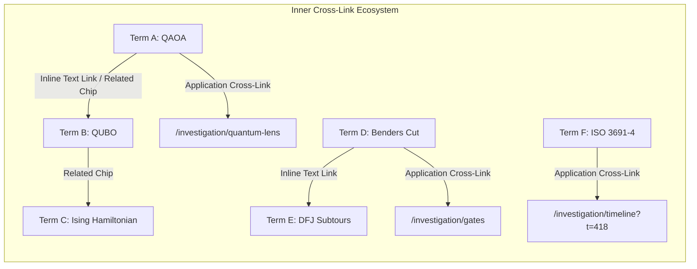

# Implementation Plan: Global A-Z Engineering Glossary Studio with Inner Cross-Links, Intuitive Schemas & Full-Text Search

Design and implement an exhaustive, well-organized **A–Z Engineering Glossary & Lexicon Studio** in `web_simulator`, refined with **inner cross-linking**, **intuitive vector schemas**, **interactive flowcharts**, and **full-text multi-attribute search** across all cyber-physical algorithms, quantum circuits, mathematical calculations, and ISO safety invariants in the repository.

---

## User Review Required

> [!IMPORTANT]
> **Intelligent Inner Cross-Linking Engine**:
> 1. **Term-to-Term Hyperlinking**: Any mention of another glossary term, acronym, or algorithm inside definitions and explanations is auto-linked or explicitly linked as a clickable chip/hyperlink that jumps directly to that term's detailed inspector.
> 2. **Related Concepts Graph**: Every term explicitly indexes related terms (e.g., `QAOA` $\to$ `QUBO`, `Ising Hamiltonian`, `VQE`, `COBYLA`, `Classiq Qmod`).
> 3. **Application Deep Links**: Terms cross-link directly into active simulator studios (e.g. `Gate 1 Invariant` $\to$ `/investigation/gates`, `Chute Buffer Surge` $\to$ `/investigation/chutes`, `KERS Recovery` $\to$ `/investigation/carbon-forensics`).
> 4. **Cross-Link Breadcrumb Trail**: Tracks the user's browsing journey as they jump between cross-referenced terms (`MD-VRPTW` $\to$ `Benders Decomposition` $\to$ `DFJ Formulation` $\to$ `MTZ`), with 1-click backward/forward navigation.

---

## Inner Cross-Linking Architecture

### Inner Cross-Linking Mechanics:
1. **Interactive Text Auto-Linking Component (`GlossaryRichText.tsx` or regex matcher)**:
   - Scans text for known term keywords and acronyms (`AMR`, `Benders Decomposition`, `QAOA`, `SIPP`, `CoM`, `LIFO`, `DIN EN ISO 3691-4`, `DFJ`, `MTZ`, `QUBO`, `KERS`, `VDI 2700`, etc.).
   - Renders them with a distinctive cyan dotted underline and hover preview.
   - On click, switches the selected term in the inspector, scrolling smoothly without a full page reload.
2. **Related Terms Ribbon & Graph Chips**:
   - Displayed prominently in the detail inspector header and footer.
   - Categorized chips (`Algorithms`, `Acronyms`, `Calculations`, `Standards`).
3. **Application & Studio Deep Links**:
   - Badges in the term card that link directly into other areas of `web_simulator`:
     - `/investigation/timeline`
     - `/investigation/gates`
     - `/investigation/chutes`
     - `/investigation/quantum-lens`
     - `/investigation/carbon-forensics`
     - 3D Warehouse Simulation View
     - 5-Page Vector PDF Compiler
     - Local FastAPI Engine (`http://127.0.0.1:8080/docs`)
4. **Browsing History Breadcrumbs**:
   - Displays a breadcrumb of visited terms during the session:
     `[AMR] › [Swept-Volume Dynamic HRI] › [DIN EN ISO 3691-4] › [SIPP]`
   - Allows instant return to previous terms.

---

## Interactive Schemas & Illustrations Suite

The Glossary will feature built-in vector illustration engines (`GlossarySchemaViewer.tsx`) for visual intuition:

1. **Benders Decomposition Recourse Loop**: Master MILP $\leftrightarrow$ Subproblem Infeasibility Ray $\leftrightarrow$ Valid Cut Injection flow diagram.
2. **3D Containerization & Dynamic LIFO Stacking**: Isometric 2.5D illustration of parcel support area ($\sigma \ge 0.75$), Center of Mass vector offset ($\Delta_{\text{CoM}} \le 0.15\,\text{m}$), and topological unstacking precedence DAG.
3. **QAOA Quantum Circuit Flow**: Schematic of initial $|+\rangle^{\otimes N}$ state, alternating cost phase gates $e^{-i\gamma_l \mathcal{H}_C}$ and mixer rotations $e^{-i\beta_l \sum X_i}$, with the classical COBYLA optimizer feedback loop.
4. **Hydrodynamic Buffer Conservation & Flow Regulation**: Fluid reservoir illustration showing infeed flow $\dot{Q}_{\text{in}}$, buffer tank $Q_c(t)$, conveyor clearance throughput $\mu_c$, and the $85\%$ surge backpressure threshold.
5. **Swept-Volume Dynamic HRI Separation (DIN EN ISO 3691-4)**: Spatiotemporal corridor schema showing AMR forward heading, $1.20\,\text{m}$ safety bubble, $3.0\,\text{m}$ human detection envelope, and smooth velocity-clamping deceleration arc.
6. **Kinematic Battery Discharge & KERS Energetics**: Vehicle power balance diagram separating traction ($56.8\%$), lift actuators ($21.6\%$), compute/LiDAR SLAM ($14.2\%$), and standby ($7.4\%$) with regenerative braking recuperation.
7. **4-Tier Cyber-Physical Dispatch Hierarchy**: Architecture diagram showing Tier 1 (Batching) $\to$ Tier 2 (Packing) $\to$ Tier 3 (Routing) $\to$ Tier 4 (Kinematics) with bidirectional recourse feedback.
8. **Ising QUBO Spin Lattice**: Coupled qubit interaction graph showing problem nodes mapped to qubits with couplings $J_{ij}$ and local fields $h_i$.

---

## Architectural Changes & Component Structure

### 1. Data Layer: Registry with Cross-References & Schemas
* **[NEW] [`web_simulator/src/data/glossaryRegistry.ts`](file:///c:/Users/vladimir.dobrouchkin/source/repos/classiq-library/applications/logistics/vehicle_routing_problem/web_simulator/src/data/glossaryRegistry.ts)**:
  * Typed entry interface `GlossaryEntry`:
    * `id`: unique kebab-case ID (e.g. `'benders-decomposition'`)
    * `term`: string
    * `acronym`?: string
    * `category`: `'algorithms' | 'acronyms' | 'calculations' | 'standards' | 'robotics' | 'quantum' | 'logistics'`
    * `letter`: string (A–Z)
    * `shortDefinition`: string
    * `detailedExplanation`: string
    * `latexFormula`?: string
    * `calculationMeaning`?: string
    * `standardsReference`?: string
    * `codebaseModule`?: string
    * `warehouseExample`?: string
    * `schemaType`?: `'benders_loop' | 'packing_lifo' | 'qaoa_circuit' | 'chute_hydrodynamics' | 'sipp_corridor' | 'kers_energetics' | 'dispatch_tiers' | 'ising_qubo' | 'speed_clamping'`
    * `schemaDescription`?: string
    * `relatedTermIds`: string[] (explicit inner cross-links to other glossary entry IDs)
    * `appDeepLink`?: { path: string; label: string } (link into active simulator studios)
    * `tags`: string[]
  * **50+ rich entries** spanning all project facets.

---

### 2. Illustration Engine: Vector Schemas Component
* **[NEW] [`web_simulator/src/components/GlossarySchemaViewer.tsx`](file:///c:/Users/vladimir.dobrouchkin/source/repos/classiq-library/applications/logistics/vehicle_routing_problem/web_simulator/src/components/GlossarySchemaViewer.tsx)**:
  * Dedicated modular renderer for all 9 vector schemas with dark-theme styling (`#0f172a`, `#00f0ff`, `#38bdf8`, `#10b981`, `#f59e0b`, `#f43f5e`, `#c084fc`).

---

### 3. Presentation Layer: Interactive Glossary Studio with Inner Cross-Linking
* **[NEW] [`web_simulator/src/components/GlossaryStudio.tsx`](file:///c:/Users/vladimir.dobrouchkin/source/repos/classiq-library/applications/logistics/vehicle_routing_problem/web_simulator/src/components/GlossaryStudio.tsx)**:
  * **Full-Text Inner Search Engine**: Instant filtering across terms, acronyms, definitions, formulas, module paths, and standards.
  * **A–Z Index Bar**: Letter chips `ALL`, `A` ... `Z` with active term count badges.
  * **Category Filter Pills**: Fast taxonomy slicing.
  * **Cross-Link Breadcrumb Trail**: Tracks visited terms during navigation with back/forward support.
  * **Interactive Detail Inspector**:
    * Render term header with acronym badge, category chip, and **Application Studio Deep Link** button.
    * **Related Terms Grid**: Clickable chips linking directly to related entries in the glossary.
    * **Intuitive Schema & Visual Flow**: Interactive SVG vector diagram.
    * **Mathematical Formulation**: Rendered via KaTeX with a 1-click "Copy LaTeX" button.
    * **Calculation Meaning & Variables**: Table of variables and units.
    * **Detailed Explanation with Inline Term Auto-Linking**: Clickable keywords jump straight to related terms.
    * **Codebase Module Link & Industrial Standards Badge**.
  * **Export Actions**: Export Glossary JSON snapshot, copy definition, copy KaTeX formula.

---

### 4. Navigation & Sidebar Integration
* **[MODIFY] [`web_simulator/src/components/navigation/SidebarNavigation.tsx`](file:///c:/Users/vladimir.dobrouchkin/source/repos/classiq-library/applications/logistics/vehicle_routing_problem/web_simulator/src/components/navigation/SidebarNavigation.tsx)**:
  * In the frozen bottom tray (above FastAPI runner):
    * High-visibility tile with `BookOpen` icon, glowing cyan/purple accent, `"A–Z Engineering Glossary"`, `"Visual Schemas & Math Lexicon"`, `Ctrl+G` badge.
    * Collapsed 56px mode: compact 38x38 button with `BookOpen` icon and `A-Z` badge.
    * Google Analytics 4 tracking (`trackSidebarNavigation`, `trackButtonClick`, `trackTabChange`).
* **[MODIFY] [`web_simulator/src/utils/navigationRoutes.ts`](file:///c:/Users/vladimir.dobrouchkin/source/repos/classiq-library/applications/logistics/vehicle_routing_problem/web_simulator/src/utils/navigationRoutes.ts)**:
  * Add `/glossary` route with complete metadata.
* **[MODIFY] [`web_simulator/src/types/navigationState.ts`](file:///c:/Users/vladimir.dobrouchkin/source/repos/classiq-library/applications/logistics/vehicle_routing_problem/web_simulator/src/types/navigationState.ts)**:
  * Add `'glossary'` to `ActiveTab`.
* **[MODIFY] [`web_simulator/src/App.tsx`](file:///c:/Users/vladimir.dobrouchkin/source/repos/classiq-library/applications/logistics/vehicle_routing_problem/web_simulator/src/App.tsx)**:
  * Wire `'glossary'` view, deep links (`/glossary`, `/glossary?term=...`), and dynamic head updates via `updatePageMetadata`.

---

## Verification Plan

### Automated Build Verification
* Run `npm run build` in `web_simulator` (`tsc && vite build`) to ensure 0 TypeScript compilation errors and 0 syntax issues.

### Static Verification
* Verify all vector SVGs render cleanly without missing viewBox or coordinate bugs.
* Verify cross-link resolution: all `relatedTermIds` point to valid existing entry IDs with zero dead links.
* Adhere strictly to the constraint: **Do NOT run browser automated test agent (`browser_subagent`), ask only**.
